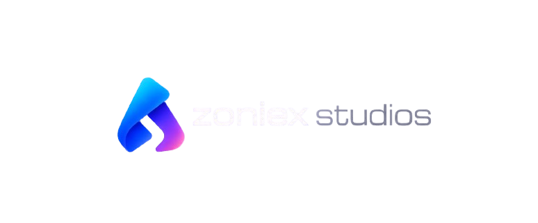

# Hi, I'm CyberXpulse

  

Modern application development focused on performance, minimal design, and scalable experiences.

---

### Tech Stack

**Languages & Frameworks**

  

**Backend & Infrastructure**

  

**Tools & Platforms**

  

---

### Focus

- Mobile Applications  
- Web Development  
- UI / UX Design  
- Developer Tools  
- Creative Technologies  

---

### 🎯 For Hire

  <strong> Available for freelance & contract work</strong>

I'm passionate about building exceptional digital experiences. Whether you need:
- Custom mobile or web applications
- UI/UX design & optimization
- Backend infrastructure & APIs

Let's collaborate and create something amazing together!

📧 **Contact:** contact@zoniexlabs.xyz  

---

  

  Clean design • Efficient systems • Modern experiences

